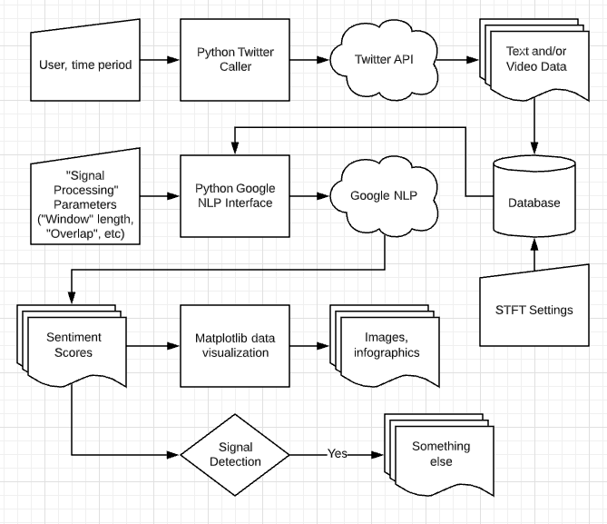

# Tweet Disco Guide

## Use Cases
Twitter accounts should present an inherently non-stationary signal. Observing changes in a particular user over time could provide insight to that users behavior over time. Perhaps this could be used to predict future behavior. 

## Jeremiah Sullivan. EC601 Boston University, September 2019. 

This repository contains the code necessary for a simple twitter relationship query using the following libraries
> python-twitter

> Google Vision

>  Google NLP

## Installation guide

Perhaps make a make file, but for now... 

## Python-Twitter

>> pip install python-twitter

## Google Vision

## Google NLP
>> pip install --upgrade google-cloud-language
>> pip install --upgrade google-api-python-client
>> pip install oauth2client

## API Storage

In the interest in simplicity as the author can barely keep his eyes open, all API keys shall be stored in seperate ascii text (.txt) files. 
These files will be easy to read for an external program, but *shall* be ignored by git. 
This *shall* be ensured by appropriately building the ".gitignore" file. 

Similarly, any data (initial, intermediate, or final), *should* be stored in a seperate file and similarly ignored by the ".gitignore" file.  

## System Diagram 

